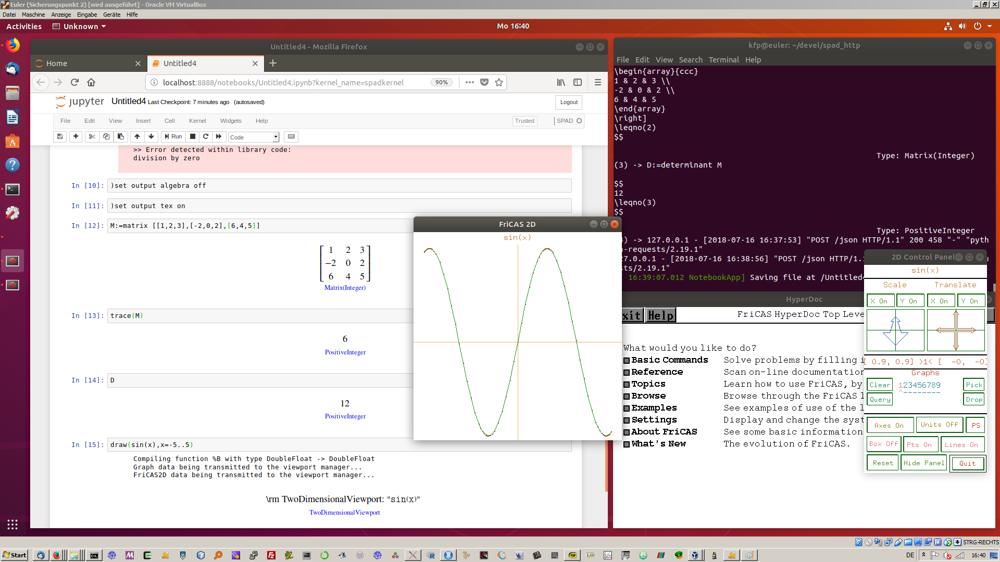

# spad_http : Jupyter kernel for SPAD 


This is a beta version of a new Jupyter kernel for FriCAS, Axiom ...


1. `git clone https://github.com/nilqed/spad_http.git`
2. `cd spad_http`
3. `./start.sh`
4. `NEW -> SPAD`





### Required 

- FriCAS (in path: fricas), compiled with multi-threaded Lisp (e.g. `SBCL > 1.4.x`)
- Python/Jupyter (python 2 required !!)
- Python modules (pip install): ` requests, plotly`  
- bash (for ` start.sh` )

### Status
- Text (charybdis) and LaTeX working
- Code completion 
- stdout/stderr -> Notebook
- todo: timing (set message time on) , plotting, inspection


### Tested with
```
  Value = "FriCAS 1.3.3 compiled at Don Apr 12 19:26:08 CEST 2018"
  .... compiled with sbcl --version SBCL 1.4.6
  jupyter --version ==> 4.4.0
  Ubuntu 16.04 LTS

- Value = "FriCAS 1.3.4 compiled at Do Jul 12 20:14:56 CEST 2018"
  ..... compiled with sbcl --version SBCL 1.4.9
  jupyter --version ==> 4.4.0
  jupyter notebook --version ==> 5.6.0
  Ubuntu 18.04 LTS
```


#### Note(s):

There is now a jupyter notebook stop command that takes a port number 
and shuts down the corresponding notebook server.
From 5.1, also  `HTTP --> POST` request to `/api/shutdown`.
In start.sh we use `jupyter notebook stop 8888` after FriCAS `)quit`.


#### How it works


The directory `spad_http"` contains, besides a local `quicklisp` distribution, **Hunchentoot** - *The Common Lisp web server* formerly known as TBNL (see http://edicl.github.io/hunchentoot/). The subdirectory `spadserver` contains a Python wrapper kernel (see [http://jupyter-client.readthedocs.io/en/stable/wrapperkernels.html) which starts an instance of FriCAS and loading the webserver by `start.input` at the same time. The HTTP server is listening on port `4242` (may be changed, of course) for `GET/PUT` requests by the kernel. Data interchange goes via `JSON` (see https://github.com/nilqed/webSPAD for details).

```
-- Manually starting .......... cd spad_http && fricas -eval ")r start" 
-- Test http server with ...... http://localhost:4242/eval?code=D(x^n,x,6)
```

